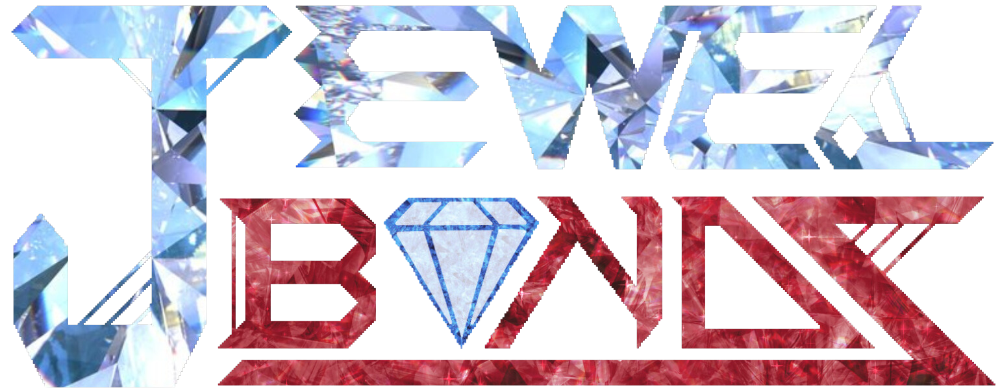
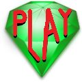
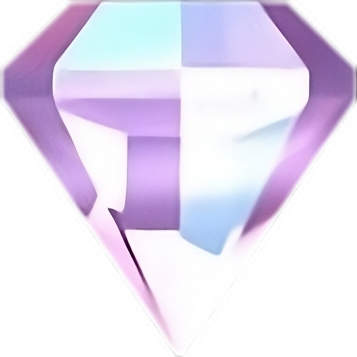

  

 

Click the PLAY Button to begin!

  

  
  
  
  
  

# Description:
Jewel Bondz is a Phaser3 TypeScript-built web game where you adventure in a magical, and mystical cave full of jewels!
Your goal is to make sure all the jewels are cleared from the screen, while achieving the 
highest score in the least number of turns. You are allowed to make a single jewel go away, or 
you can connect two to three jewels at a time (in either a line or triangle). The more jewels 
you connect with, the less turns will be taken off. Plus, turns will be added when jewels are 
inside the area of a triangle, which allows you to keep playing! 

Jewel Bondz is hopeful to improve one's critical thinking, decision making, and motivation 
throughout their lives. This can, ultimately, bring the reduction of anxiety levels, and 
reflect decisions made within the game to decisions of the real world. 

# Controls:
If you're using a computer: **Mouse / Touchpad 🖱️** 
If you're on a handheld device: **Touchscreen 📱👆** 
(It is recommended to have a large touchscreen if planning to use Jewel Bondz on a handheld 
device, e.g. an iPad. Any device, no matter what it is, will work with this game. Just ensure 
it, or the browser you're using, supports the modern web development languages associated in 
this repository.) 

To draw lines from the jewels, drag and hold to connect with another jewel of the same type. 
You can only connect jewels of the same type, and attempting to connect with others of 
different types won't be allowed. If a mistake is made upon connecting jewels, simply let go to 
try again. You can't reverse the locked line connection once it's made, but it can be done 
again as soon as you let go from drawing. That is unless the pointer or finger is inside the jewel. 

# Scoring and Turns:

Score: 
1 Jewel by itself = 1 * 100 Ptns  
2 Jewels in a line = 2 * 200 Ptns  
3 Jewels in a triangle = 3 * 300 Ptns 
 
Turns: 
Any action done = -1 Turn 
If one jewel was inside a triangle = +1 Turn 
 
Each jewel that's inside the triangle will add one turn!

# Copyright:
Jewel Bondz was influenced from a minigame called Pearl Diver in [**Zenses Ocean**](https://vimm.net/vault/?p=play&mediaId=27656). It was a collection of six relaxing minigames (incl. Pearl Diver) for the Nintendo DS back in 2008; built by [**Shin'en Multimedia and The Game Factory**](https://www.shinen.com/games/game.php3?zenses%20ocean). Shin'en Multimedia is known for developing high quality games for the Game Boy Color, Game Boy Advanced, DS, Wii, WiiU, 3DS and Switch. While best from Nintendo's consoles and handhelds, they've also done games on the Xbox One, PS4/5, and Windows (Steam). Popular games include Art Of Balance, Jett Rocket, Fast RMX, and The Touryst. 

All of the code written in Jewel Bondz is original and object-oriented; created by me and with a little bit of GitHub CoPilot assistance. It is ment to be a fun recreation of Pearl Diver and does not infringe any of the original code made from Shin'en Multimedia. Jewel Bondz is also not a prefect recreation, despite most of the functionality being similar to Pearl Diver. 

The sources used when playing the game originate from the following below:

* **Sources of Images were:**
  * Created by me (using [Canva](https://www.canva.com/en_gb/))
  * Are Free of Use (Stock images or from a free PNG website)
  * or created from AI (specifically [DeepDreamGenerator](https://deepdreamgenerator.com/) for background images)
   
  (NOTE: Some images may be a combination of either one, the unmodified ones are from the given links)

* **Sources of SFX & Music:**
  * [Pixabay](https://pixabay.com/)
  * [SoundSnap](https://www.soundsnap.com/)
  * [StoryBlocks](https://www.storyblocks.com/)
   
  (NOTE: Some audio was extracted via page inspection)

I encourage users to understand the MIT License of Phaser and use of this game before distributing modified copies this game as your own. Please include the proper credit and the licence notice before releasing your version of this game to the public in GitHub, as I've worked hard to get this game to work properly.

# Here's an example of gameplay in Jewel Bondz:

 
  

